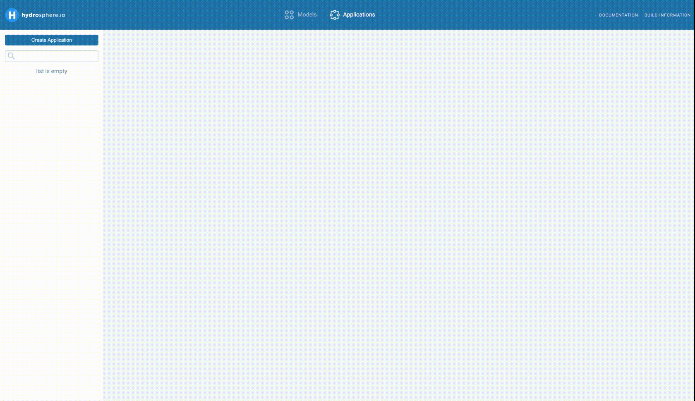
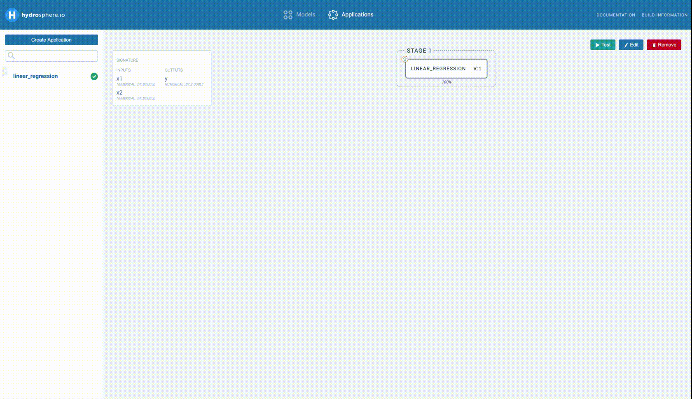

# Getting Started

On this page you will learn how to deploy your first model on the Hydrosphere platform. We will start from scratch and create a simple logistic regression model that will fit our randomly generated data, with some noise added to it. After the training step, we will pack the model, deploy it to the platform, and invoke it locally with a sample client.

## Before you start

We assume you already have a [deployed](installation/) instance of the Hydrosphere platform and a [CLI](installation/cli.md) on your local machine.

To let `hs` know where the Hydrosphere platform runs, configure a new `cluster` entity.

```bash
hs cluster add --name local --server http://localhost
hs cluster use local
```

## Training a model

We can now start working with the logistic regression model. It is a fairly simple model that fits a randomly generated regression data with some noise added to it. For data generation, we will use the `sklearn.datasets.make_regression` \([link](https://scikit-learn.org/stable/modules/generated/sklearn.datasets.make_regression.html)\) method. 

First of all, create a directory for the model and add `model.py` in to it.

```bash
mkdir logistic_regression
cd logistic_regression
touch train.py
```

Let's choose a simple `sklearn.LogisticRegression`  model as an example. Put the following code in your `train.py` file.


```python
import joblib
from sklearn.datasets import make_blobs
from sklearn.linear_model import LogisticRegression

# initialize data
X, y = make_blobs(n_samples=300, n_features=2, centers=[[-5, 1],[5, -1]])

# create a model
model = LogisticRegression()
model.fit(X, y)

joblib.dump(model, "model.joblib")
```


We have not yet installed the necessary libraries for our model. In your `logistic_regression` folder, create a `requirements.txt` file with the following contents:


```text
numpy~=1.18
scipy==1.4.1
scikit-learn~=0.23
```


Install all dependencies to your local environment.

```bash
$ pip install -r requirements.txt
```

Train the model.

```bash
$ python train.py
```

As soon as the script finishes, you will get a model saved to a `model.joblib` file.

## Model preparation

Every model in a cluster is deployed as an individual container. After a request is sent from the client application, it is passed to the appropriate Docker container with your model deployed on it. An important detail is that all model files are stored in the `/model/files` directory inside the container, so we will look there to load the model.

To run this model we will use a Python runtime that can execute any Python code you provide. Preparation of a model is pretty straightforward, though you have to follow some rules:

1. Stick to the specific folder structure to let `hs` parse and upload

   it correctly;

2. Provide necessary dependencies with the `requirements.txt`;
3. Provide a contract file to let the model manager understand the

   model's inputs and outputs.

We will begin with the main functional file.

```bash
mkdir src
cd src
touch func_main.py
```

Hydrosphere communicates with the model using [TensorProto](https://github.com/Hydrospheredata/hydro-serving-protos/blob/master/src/hydro_serving_grpc/tf/tensor.proto) messages. If you want to perform a transformation on the received TensorProto message, you will have to retrieve its contents, perform a transformation on them and pack the result back to the TensorProto message. To do that you have to define a function that will be invoked every time Hydrosphere handles a request and passes it to the model. Inside that function, you have to call a `predict` \(or similar\) method of your model and return your predictions.


```python
import joblib
import numpy as np

# Load model once
model = joblib.load("/model/files/model.joblib")


def infer(x1, x2):
    # Make a prediction
    y = model.predict([[x1, x2]])

    # Return the scalar representation of y
    return {"y": np.asscalar(y)}
```


We do initialization of the model outside of the serving function so this process will not be triggered every time a new request comes in. We do that on step \(0\). The serving function `infer` takes the actual request, unpacks it \(1\), makes a prediction \(2\), packs the answer back \(3\) and returns it \(4\). There is no strict rule for function naming, it just has to be a valid Python function name.

If you're wondering how Hydrosphere will understand which function to call from `func_main.py` file, the answer is that we have to provide a **contract**. A contract is a file that defines the inputs and the outputs of the model, a signature function and some other metadata required for serving. Go to the root directory of the model and create a `serving.yaml` file.

```bash
cd ..
touch serving.yaml
```


```yaml
kind: Model
name: logistic_regression
runtime: hydrosphere/serving-runtime-python-3.7:2.3.2
install-command: pip install -r requirements.txt
payload:
  - src/
  - requirements.txt
  - model.joblib

contract:
  name: infer
  inputs:
    x1:
      shape: scalar
      type: double
      profile: numerical
    x2:
      shape: scalar
      type: double
      profile: numerical
  outputs:
    y:
      shape: scalar
      type: double
      profile: categorical
```


Here you can see that we have provided a `requirements.txt` and a `model.h5` as payload files to our model.

The overall structure of our model now should look like this:

```text
logistic_regression
├── model.joblib
├── train.py
├── requirements.txt
├── serving.yaml
└── src
    └── func_main.py
```


Although we have `train.py` inside the directory, it will not be uploaded to the cluster since we did not specify it in the contract's payload.


## Serving the model

Now we can upload the model. Inside the `logistic_regression` directory, execute the following command:

```bash
hs upload
```

You can open the [http://localhost/models](http://localhost/models) page to see the uploaded model.

Once you have opened it, you can create an **application** for it. Basically, an application represents an endpoint to your model, so you can invoke it from anywhere. To learn more about advanced features, go to the [Applications](https://github.com/Hydrospheredata/hydro-serving/tree/54b7457851ad9de078cd092f083b8492dea6edca/docs/getting-started/concepts/applications.md) page.



Open [http://localhost/applications](http://localhost/applications) and press the `Add New Application` button. In the opened window select the `logistic_regression` model, name your application `logistic_regression` and click the creation button.

If you cannot find your newly uploaded model and it is listed on your models' page, it is probably still in the building stage. Wait until the model changes its status to `Released`, then you can use it.

## Invoking an application

Invoking applications is available via different interfaces. For this tutorial, we will cover calling the created Application by gRPC via our Python SDK.

Define a gRPC client on your side and make a call from it.


```python
from sklearn.datasets import make_blobs
from hydrosdk import Cluster, Application

cluster = Cluster("http://localhost", grpc_address="localhost:9090")

app = Application.find(cluster, "logistic_regression")
predictor = app.predictor()

X, _ = make_blobs(n_samples=300, n_features=2, centers=[[-5, 1],[5, -1]])
for sample in X:
    y = predictor.predict({"x1": sample[0], "x2": sample[1]})
    print(y)
```



## Using Deployment Configurations

TODO

## Getting Started with Monitoring

Hydrosphere Platform has multiple tools for data drift monitoring:

1. Data Drift Report
2. Automatic Outlier Detection
3. Profiling

In this tutorial, we'll look at the monitoring dashboard and Automatic Outlier Detection feature.


Hydrosphere Monitoring relies heavily on training data. Users **must** provide training data to enable monitoring features.


To provide training data users need to add the `training-data=<path_to_csv>`  field to the `serving.yaml` file. Run following script to save training data used in previous steps as a `trainig_data.csv` file.


```python
import pandas as pd
from sklearn.datasets import make_blobs

# Create training data
X, y = make_blobs(n_samples=300, n_features=2, centers=[[-5, 1],[5, -1]])

# Create pandas.DataFrame from it
df = pd.DataFrame(X, columns=['x1', 'x2'])
df['y'] = y

# Save it as .csv
df.to_csv("training_data.csv", index=False)
```


Next, we add the training data field to the model definition inside the `serving.yaml` file.


```yaml
kind: Model
name: logistic_regression
runtime: hydrosphere/serving-runtime-python-3.7:2.3.2
install-command: pip install -r requirements.txt
training-data: training_data.csv
payload:
  - src/
  - requirements.txt
  - model.joblib
contract:
  name: infer
  inputs:
    x1:
      shape: scalar
      type: double
      profile: numerical
    x2:
      shape: scalar
      type: double
      profile: numerical
  outputs:
    y:
      shape: scalar
      type: double
      profile: categorical
```


Now we can upload the model.Execute the following command to create a new version of `logistic_regresion` model:

```bash
hs upload
```

You can open the [http://localhost/models](http://localhost/models) page to see that there are now two versions of a `logistic_regression` model.

For each model with uploaded training data, Hydrosphere creates an outlier detection metric, which assigns an outlier score to each request. This metric label request as an outlier if the outlier score is greater than the 97th percentile of training data outlier scores distribution.  

Let's send some data to our new model version. To do so, we need to update our `logistic_regression` application. To update it, we can go to **Application** tab and click the upgrade button.



After upgrading our Application, we can reuse our old code to send some data:


```python
from sklearn.datasets import make_blobs
from hydrosdk import Cluster, Application

cluster = Cluster("http://localhost", grpc_address="localhost:9090")

app = Application.find(cluster, "logistic_regression")
predictor = app.predictor()

X, _ = make_blobs(n_samples=300, n_features=2, centers=[[-5, 1],[5, -1]])
for sample in X:
    y = predictor.predict({"x1": sample[0], "x2": sample[1]})
    print(y)
```


You can monitor your data quality in the Monitoring Dashboard:


Monitoring dashboards plots all requests streaming through a model version which are colored in respect with how "healthy" they are. On the horizontal axis we group our data by batches and on the vertical axis we group data by signature fields. In this plot cells are determined by their batch and field. Cells are colored from green to red, depending on the average request health inside this batch. 

To check whether our metric will be able to detect data drifts, let's simulate one and send data from another distribution. To do so, we modify our code slightly:


```python
from sklearn.datasets import make_blobs
from hydrosdk import Cluster, Application

cluster = Cluster("http://localhost", grpc_address="localhost:9090")

app = Application.find(cluster, "logistic_regression")
predictor = app.predictor()

# Change make_blobs arguments to simulate different distribution 
X, _ = make_blobs(n_samples=300, n_features=2, centers=[[-10, 10],[0, 0]])
for sample in X:
    y = predictor.predict({"x1": sample[0], "x2": sample[1]})
    print(y)
```


You can validate that our model was able to detect data drifts on the monitoring dashboard. 

