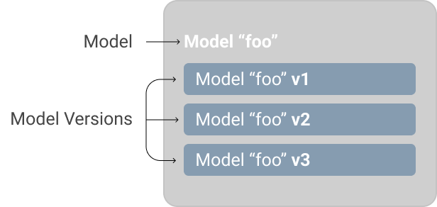
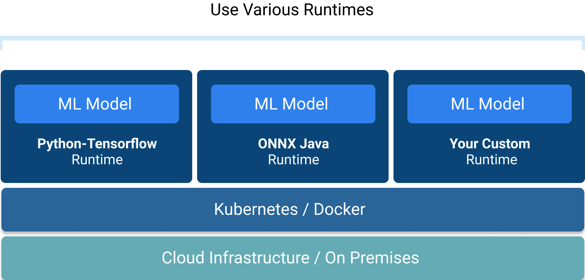
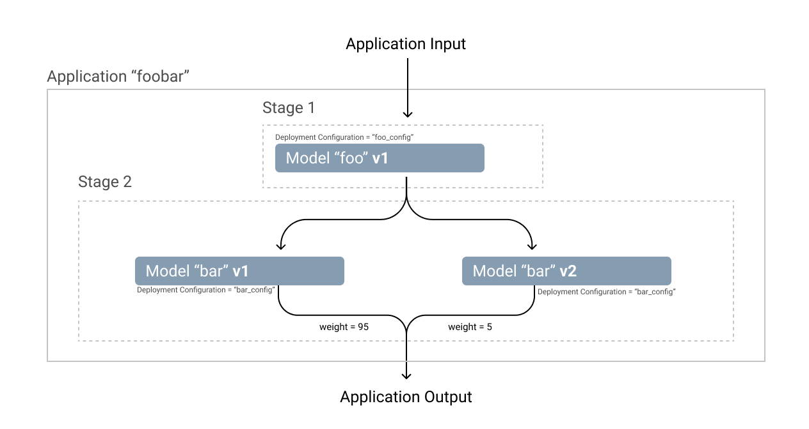

# Concepts

## Resource definitions

**Resource definitions** describe **Models**, **Applications**, and **Deployment Configurations** in a YAML format. You can learn more about them in the [How to write resource definitions](../how-to/write-definitions.md) section.

## Serving

### Models & Model Versions

A **Model** is a machine learning model or a processing function that consumes provided inputs and produces predictions or transformations.

Within the Hydrosphere platform, we break down the model to its versions. Each **Model version** represents a single Docker image containing all the artifacts that you have uploaded to the platform. Consequently, **Model** is a group of **Model versions** with the same name.



### Runtimes

A **Runtime** is a docker image with the predefined gRPC interface which loads and serves your model.



We have [implemented](../reference/runtimes.md) a few runtimes, which you can use in your own projects.

### Servable

**Servable** is a deployed instance of a Model version combined with a Runtime. It exposes a gRPC endpoint that can be used to send requests.

User should not use Servable as-is, since it's are designed to be a building block, rather than inference endpoint. We provide a better alternative to deploy a Model version — Application.

### Applications

An **Application** is a pipeline of one or more stages, each consisting of one or multiple Model Versions. Data sent to an application stage is shadowed to all of it's model versions. Output of a staged is picked randomly with respect to weights



When a user creates Application, Manager service automatically deploys appropriate Servables. The Application handles monitoring of your models and is able to perform A/B traffic split.

For each Application, there are publicly available HTTP and gRPC endpoints that you can send requests to.

### Deployment Configurations

A **Deployment Configuration** is a collection of Kubernetes settings that you can set for your Servables and Model Versions used in stages of Applications.

Deployment Configuration covers:

* Horizontal Pod Autoscaler specs
* Container Specs 
  * Resource requirements - limits and requests 
* Pod Specs
  * Node Selectors
  * Affinity
  * Tolerations
* Deployment Specs
  * Replicas count

### Model's Signature

A **Model's** **Signature** is a specification of your model computation which identifies the name of a function with its inputs and outputs, including their names, shapes, and data types.

e.g. signature defined in a YAML file:

```yaml
contract:
  name: predict
  inputs:
    x:
      shape: [-1, 2]
      type: double
      profile: numerical
  outputs:
    y:
      shape: scalar
      type: int
      profile: categorical
```

### Field

A **Field** is a basic element of a Model's signature. It has name, shape, data type, and profile.

e.g. model's signature field defined in a YAML file:

```yaml
x:
  shape: [-1, 2]
  type: double
  profile: numerical
```

### Field\`s Profile

A **Profile** is a special tag that tells how Hydrosphere should interpret the field's data.

There are multiple available tags: Numerical, Categorical, Image, Text, Audio, Video, etc.

## Monitoring

### Metrics

Data coming through deployed Model Versions can be monitored with metrics.

**Metric** is a Model Version that takes a combination of inputs & outputs from another monitored Model Version, receives every request and response from the monitored model, produces a single value, and compares it with a threshold to determine whether this request was healthy or not.

Every request is evaluated against all metrics assigned to the model.

### Checks

A **check** is a boolean condition associated with a field of a Model Version signature which shows for every request whether field value is acceptable or not.

e.g. Min/Max checks ensure that field value is in an acceptable range which is inferred from training data values.

### 

