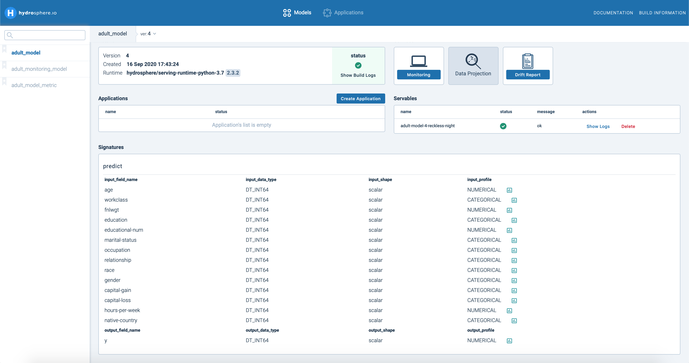
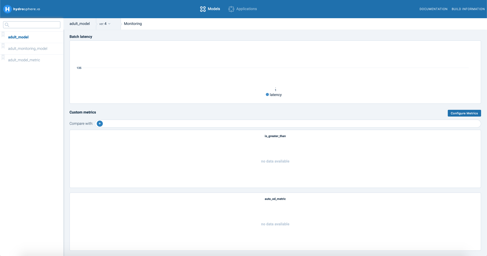

# Monitoring Anomalies with a Custom Metric

## Overview

In this tutorial, you will learn how to create a custom anomaly detection metric for a specific use case. 

Let's take a problem described in the previous [Train & Deploy Census Income Classification Model](https://app.gitbook.com/@hydrosphere/s/home/~/drafts/-MHGvmrVrOLoZn1Rkock/tutorials/train-and-deploy-census-income-classification-model) tutorial as a use case and [census income dataset](https://www.kaggle.com/wenruliu/adult-income-dataset) as a data source. We will monitor a model that classifies whether the income of a given person exceeds $50.000 per year.  

We will look at the following steps: 

* Training a monitoring model 
* Deployment of a monitoring model with SDK
* Managing сustom metrics with UI
* Uploading a monitoring model with CLI

## Prerequisites

For this tutorial, you will need a deployed instance of the **Hydrosphere platform** and **Hydro CLI** installed on your local machine. If you haven't done this yet, please explore these pages first: 





This tutorial is a sequel to the previous tutorial. Please complete it first to have a prepared dataset and a trained model deployed to the cluster:



## Train a Monitoring Model

Basically the steps are the same as for a common model. Before training and uploading, we create a directory for a monitoring model with an `/src` folder inside containing a functional file `func_main.py`:

```bash
mkdir -p monitoring_model/src
cd monitoring_model
touch src/func_main.py
```

As a monitoring metric, we will use **IsolationForest**. You can learn how it works in [its documentation](https://scikit-learn.org/stable/modules/generated/sklearn.ensemble.IsolationForest.html). 

To be sure that our monitoring model will see the same data as our prediction model, we are going to apply the training data that was saved previously for our monitoring model. 

```python
import joblib
import pandas as pd
import matplotlib.pyplot as plt
from sklearn.ensemble import IsolationForest

X_train = pd.read_csv('data/train.csv', index_col=0)

monitoring_model = IForest(contamination=0.04)

train_pred = monitoring_model.fit_predict(X_train) 

train_scores = monitoring_model.decision_function(X_train)

plt.hist(
    train_scores,
    bins=30, 
    alpha=0.5,
    density=True, 
    label="Train data outlier scores"
)

plt.vlines(monitoring_model.threshold_, 0, 1.9, label = "Threshold for marking outliers")
plt.gcf().set_size_inches(10, 5)
plt.legend()

dump(monitoring_model, "monitoring_model/monitoring_model.joblib")
```


This is what the distribution of our inliers looks like. By choosing a contamination parameter we can regulate a threshold that will separate inliers from outliers accordingly. You have to be thorough in choosing it to avoid critical prediction mistakes. Otherwise, you can also stay with `'auto'`.  To create a monitoring metric, we have to deploy that IsolationForest model as a separate model on the Hydrosphere platform. Let's save a trained model for serving.

## Deploy a Monitoring Model with SDK

First, in the deployment process, let's create a new directory where we will declare the serving function and its definitions. Inside the `src/func_main.py` file put the following code:



```python
import numpy as np
from joblib import load

monitoring_model = load('/model/files/monitoring_model.joblib')

features = ['age', 'workclass', 'fnlwgt',
            'education', 'educational-num', 'marital-status',
            'occupation', 'relationship', 'race', 'gender',
            'capital-gain', 'capital-loss', 'hours-per-week',
            'native-country']

def predict(**kwargs):
    x = np.array([kwargs[feature] for feature in features]).reshape(1, len(features))
    predicted = monitoring_model.decision_function(x)

    return {"value": predicted.item()}
```



Next, we need to install the necessary libraries. Create a `requirements.txt` and add the following libraries to it:

```bash
joblib==0.13.2
numpy==1.16.2
scikit-learn==0.23.1
```

As with common models, we can use SDK to upload and bind our monitoring model to the trained one. The steps are almost the same, but with some slight differences. First, given that we want to predict the anomaly score instead of sample class, we need to change the type of output field from `'int64'` to `'float64'`. 

Secondly, we need to apply a couple of new methods for a metric creation. `MetricSpec` is responsible for a metric creation for a specific model,with specific `MetricSpecConfig.`

```python
from hydrosdk.monitoring import MetricSpec, MetricSpecConfig, ThresholdCmpOp

path_mon = "monitoring_model/"
payload_mon = ['src/func_main.py', 
               'monitoring_model.joblib', 'requirements.txt']
            
monitoring_signature = SignatureBuilder('predict') 
for i in X_train.columns:
    monitoring_signature.with_input(i, 'int64', 'scalar')
monitor_signature = monitoring_signature.with_output('value', 'float64', 'scalar').build()

monitor_contract = ModelContract(predict=monitor_signature)

monitoring_model_local = LocalModel(name="adult_monitoring_model", 
                              install_command = 'pip install -r requirements.txt',
                              contract=monitor_contract,
                              runtime=DockerImage("hydrosphere/serving-runtime-python-3.7", "2.3.2", None),
                              payload=payload_mon,
                              path=path_mon)
monitoring_upload = monitoring_model_local.upload(cluster)
monitoring_upload.lock_till_released()

metric_config = MetricSpecConfig(monitoring_upload.id, monitoring_model.threshold_, ThresholdCmpOp.LESS)
metric_spec = MetricSpec.create(cluster, "custom_metric", model_find.id, metric_config)

```

Anomaly scores are obtained through [traffic shadowing](../overview/hydrosphere-features/traffic-shadowing.md) inside the Hydrosphere's engine after making Servable, so you don't need to make any additional manipulations.

## Managing Custom Metrics with UI

You can use the UI to observe and manage your monitoring models. Go to the Monitoring dashboard:



Now, as you can notice, you have two external metrics: the first one, `auto_od_metric` was formed automatically by [Automatic Outlier Detection](https://app.gitbook.com/@hydrosphere/s/home/~/drafts/-MHLfibGIoeUmdpQR30S/overview/features/automatic-outlier-detection) and the new one, `custom_metric`,  that we have just created. You can also change settings for existent metrics and configuring new ones in the  `Configure Metrics` section.



During prediction, you will obtain anomaly scores for each sample in the form of a continuous curved line and dotted line, which is our threshold. The intersection of the latter one might signalize about potential anomalousness, but it is not always true, as there are many factors that might affect this, so be careful about final interpretation.


## Uploading a Monitoring model with CLI

As with all other models, we can define and upload a model using a resource definition . This model also has to be packed with a model definition as we did in the previous tutorial.

```yaml
kind: Model
name: "adult_monitoring_model"
payload:
  - "src/"
  - "requirements.txt"
  - "monitoring_model.joblib"
runtime: "hydrosphere/serving-runtime-python-3.7:2.3.2"
install-command: "pip install -r requirements.txt"
contract:
  name: "predict"
  inputs:
    age:
      shape: scalar
      type: int64
    workclass:
      shape: scalar
      type: int64
    education:
      shape: scalar
      type: int64
    marital_status:
      shape: scalar
      type: int64
    occupation:
      shape: scalar
      type: int64
    relationship:
      shape: scalar
      type: int64
    race:
      shape: scalar
      type: int64
    sex:
      shape: scalar
      type: int64
    capital_gain:
      shape: scalar
      type: int64
    capital_loss:
      shape: scalar
      type: int64
    hours_per_week:
      shape: scalar
      type: int64
    country:
      shape: scalar
      type: int64
    classes:
      shape: scalar
      type: int64
  outputs:
    value:
      shape: scalar
      type: float64
```

Inputs of this model are the inputs of the target monitored model plus the outputs of that model. As an output for the monitoring model itself, we will use the `value` field. The final directory structure should look like this:

```text
.
├── monitoring_model.joblib
├── requirements.txt
├── serving.yaml
└── src
    └── func_main.py
```

From that folder, upload the model to the cluster.

```bash
hs apply -f serving.yaml
```

Now we have to attach the deployed Monitoring model as a custom metric. Let's create a monitoring metric for our pre-deployed classification model.



1. From the _Models_ section, select the target model you would like to deploy and select the desired model version;
2. Open the _Monitoring_ tab.
3. At the bottom of the page click the `Configure Metric` button;
4. From the opened window click the `Add Metric` button;
   1. Specify the name of the metric;
   2. Choose the monitoring model;
   3. Choose the version of the monitoring model;
   4. Select a comparison operator `Greater`. This means that if you have a metric value greater than a specified threshold, an alarm should be fired;
   5. Set the threshold value. In this case, it should be equal to the value of `monitoring_model.threshold_`.
   6. Click the `Add Metric` button.



That's it. Now you have a monitored income classifier deployed on the Hydrosphere platform.

