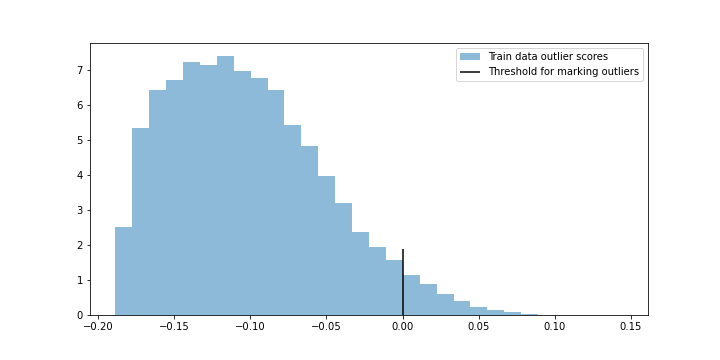

# Monitor anomalies with a custom metric


This tutorial is a work in progress


On this page you will learn how to create a custom anomaly detection metric for a specific use case.

## Overview

For this use case we have chosen a problem described in a [Train & Deploy Census Income Classification Model](https://app.gitbook.com/@hydrosphere/s/home/~/drafts/-MHGvmrVrOLoZn1Rkock/tutorials/train-and-deploy-census-income-classification-model) tutorial. We will monitor the model, which will classify whether the income of a given person exceeds $50.000 per year. 

As a data source we will use the census income [dataset](https://www.kaggle.com/wenruliu/adult-income-dataset).

## Before you start

* We assume you already have [installed](../installation/) Hydrosphere platform and a [CLI](../installation/cli.md) on your local machine.
* This tutorial is a sequel to Train & Deploy Census Income Classification Model tutorial. We assume that you have already prepared dataset, trained a model and deployed it to a cluster. If not, then please click to the [previous](https://app.gitbook.com/@hydrosphere/s/home/~/drafts/-MHGvmrVrOLoZn1Rkock/tutorials/train-and-deploy-census-income-classification-model) tutorial. 

## Train Monitoring Model

Basically steps are the same as with a common model. Before training and uploading, let's create a directory for our model.

```bash
mkdir -p monitoring_model/src
cd monitoring_model
touch src/func_main.py
```

As a monitoring metric, we will use the `sklearn.ensemble.IsolationForest`. You can read more about how it works in [its documentation](https://scikit-learn.org/stable/modules/generated/sklearn.ensemble.IsolationForest.html).

```python
import joblib
import pandas as pd
import matplotlib.pyplot as plt
from sklearn.ensemble import IsolationForest


# #main-section
X_train = pd.read_csv('data/train.csv')

monitoring_model = IsolationForest(contamination=0.04)
monitoring_model.fit(X_train)
# #main-section


# #plot-section
y_train_pred = monitoring_model.predict(X_train)  # binary labels (0: inliers, 1: outliers)
y_train_scores = monitoring_model.score_samples(X_train)  # raw outlier scores


plt.hist(y_train_scores, 
        bins=30, 
        alpha=0.5, 
        density=True, 
        label="Train data outlier scores")

plt.vlines(monitoring_model.offset_, 0, 1.9, label = "Threshold for marking outliers")
plt.gcf().set_size_inches(10, 5)
plt.legend()
# #plot-section

joblib.dump(monitoring_model, "model/monitoring_model.joblib")
# #save-section
```

This gives us the following output. This is how distribution of our inliers look like. By choosing a contamination parameter we can regulate a threshold that will separate inliers from outliers accordingly. You have to be thorough in choosing it to avoid critical prediction mistakes. Otherwise, you can also stay with `'auto'`. 



## Deploy Monitoring Model

To create a monitoring metric, we have to deploy that IsolationForest model as a separate model on the Hydrosphere platform. Let's save a trained model for serving. Create a new directory where we will declare the serving function and its definitions.

Inside the `src/func_main.py` file put the following code:



```python
import numpy as np
from joblib import load

monitoring_model = load('/model/files/monitoring_model.joblib')

features = ['age',
            'workclass',
            'education',
            'marital_status',
            'occupation',
            'relationship',
            'race',
            'sex',
            'capital_gain',
            'capital_loss',
            'hours_per_week',
            'country']


def predict(**kwargs):
    x = np.array([kwargs[feature] for feature in features]).reshape(1, len(features))
    predicted = monitoring_model.decision_function(x)

    return {"value": predicted.item()}
```



This model also have to be packed with a model definition as we did in the previous turorial.

```yaml
kind: Model
name: "census_monitoring"
payload:
  - "src/"
  - "requirements.txt"
  - "monitoring_model.joblib"
runtime: "hydrosphere/serving-runtime-python-3.7:$released_version$"
install-command: "pip install -r requirements.txt"
contract:
  name: "predict"
  inputs:
    age:
      shape: scalar
      type: int64
    workclass:
      shape: scalar
      type: int64
    education:
      shape: scalar
      type: int64
    marital_status:
      shape: scalar
      type: int64
    occupation:
      shape: scalar
      type: int64
    relationship:
      shape: scalar
      type: int64
    race:
      shape: scalar
      type: int64
    sex:
      shape: scalar
      type: int64
    capital_gain:
      shape: scalar
      type: int64
    capital_loss:
      shape: scalar
      type: int64
    hours_per_week:
      shape: scalar
      type: int64
    country:
      shape: scalar
      type: int64
    classes:
      shape: scalar
      type: int64
  outputs:
    value:
      shape: scalar
      type: double
      
```

Inputs of this model are the inputs of the **target** monitored model plus the outputs of that model. As an output for the monitoring model itself we will use the `value` field.

Pay attention to the model's payload. It has the `src` folder that we have just created, `requirements.txt` with all dependencies and a `monitoring_model.joblib` file, e.g. our newly trained serialized KNN model.

`requirements.txt` looks like this:

```text
joblib==0.13.2
numpy==1.16.2
pyod==0.7.4
```

The final directory structure should look like this:

```text
.
├── monitoring_model.joblib
├── requirements.txt
├── serving.yaml
└── src
    └── func_main.py
```

From that folder, upload the model to the cluster.

```bash
hs upload
```

## Attach Deployed Monitoring Model as a Custom Metric

Let's create a monitoring metric for our pre-deployed classification model.



TODO



1. From the _Models_ section, select the target model you would like to deploy and select the desired model version;
2. Open the _Monitoring_ tab.
3. At the bottom of the page click the `Add Metric` button;
4. From the opened window click the `Add Metric` button;
   1. Specify the name of the metric;
   2. Choose the monitoring model;
   3. Choose the version of the monitoring model;
   4. Select a comparison operator `Greater`. This means that if you have a metric value greater than a specified threshold, an alarm should be fired;
   5. Set the threshold value. In this case it should be equal to the value of `monitoring_model.threshold_`.
   6. Click the `Add Metric` button.



That's it. Now you have a monitored income classifier deployed in the Hydrosphere platform.

